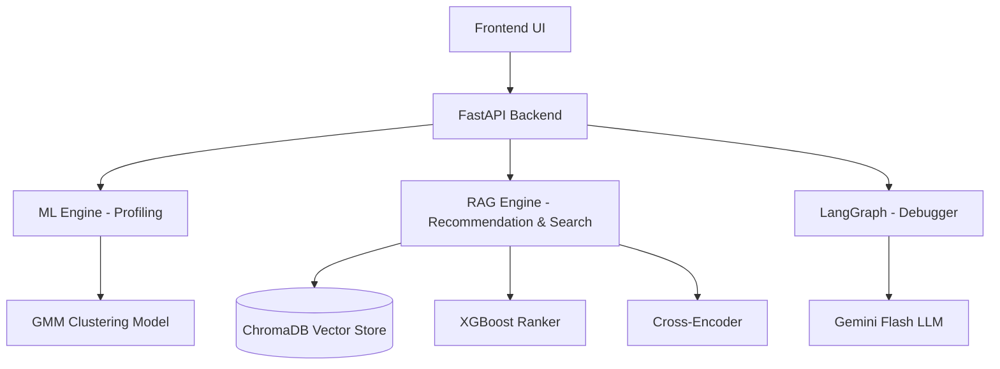
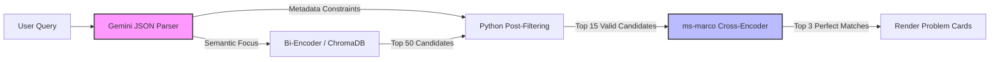
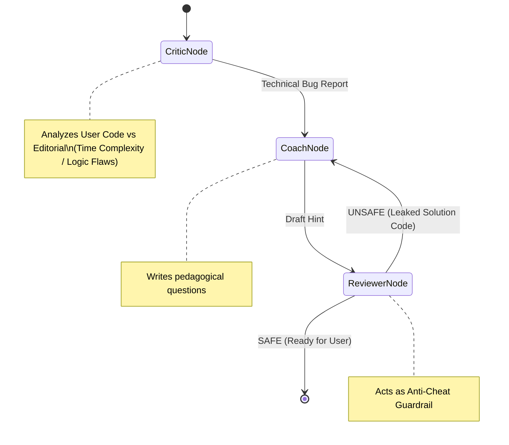

# 🏋️ Codeforces Coach — Advanced AI Training Platform

An intelligent competitive programming training system. It goes beyond simple problem recommendations by providing **Self-Querying Semantic Search**, **ML-driven Behavioral Profiling**, and a **LangGraph-powered Autonomous Socratic Debugger** to act as your personal Codeforces mentor.

---

## ✨ Core Features

| Feature | Description |
|---|---|
| **ML Profiling & Clustering** | Scrapes your CF history, engineers 16 behavioral features, and classifies you into 1 of 10 archetypes using **Gaussian Mixture Models (GMM)**. |
| **Persona-Driven Recommender** | Uses an **XGBoost** ranking pipeline to find the perfect practice problem and presents it to you using a custom Gemini LLM persona tailored to your archetype. |
| **Concept Search (2-Stage RAG)** | Find problems using natural language (e.g., *"DP on trees with rerooting"*). Powered by a **SentenceTransformer Bi-Encoder** (Recall) and a **ms-marco Cross-Encoder** (Precision). |
| **Self-Querying Retriever** | Intercepts search queries with Gemini to extract hard metadata constraints (rating limits, required tags) and applies strict **Post-Filtering** in Python. |
| **Agentic Socratic Debugger** | A **LangGraph** multi-agent state machine (Critic, Coach, Reviewer). It analyzes your failing code against the official editorial and provides Socratic hints without leaking the solution! |
| **Negative Pruning** | Automatically filters out problems the user has already attempted from the recommendation pool. |

---

## 🏗️ System Architecture

### 1. Overall Platform Data Flow


### 2. The Practice Recommendation Pipeline (ML + RAG)
1. **ML Profile:** Scrapes Codeforces API for all user submissions, engineers 16 features (accuracy, TLE rate, tag preferences), scales them, and classifies into 1 of 10 behavioral archetypes.
2. **Query Building:** Gemini reads the user profile and generates targeted ChromaDB search keywords + rating bounds.
3. **Candidate Retrieval:** ChromaDB retrieves 50 semantic candidate problems within the rating window.
4. **Negative Pruning:** Filters out every problem the user has already attempted.
5. **XGBoost Ranking:** Scores remaining candidates using 20 features (user metrics + problem stats + rating delta + tag synergy). The highest-confidence problem wins.
6. **Presentation:** Gemini presents the selected problem in the persona's character.

### 3. Self-Querying 2-Stage Concept Search


### 4. LangGraph Socratic Debugger


---

## 📊 Behavioral Archetypes (GMM Clusters)

| # | Name | Rating Range | Key Trait |
|---|------|-------------|-----------|
| 0 | The Cautious Beginner | ~1090 | High accuracy, weak Data Structures |
| 1 | The Impatient Novice | ~1170 | Over-relies on Greedy, high abandonment |
| 2 | The Persistent Grinder | ~970 | Great grit, lacks theory |
| 3 | The Fickle Advanced | ~1560 | Strong skills, overwhelmed easily |
| 4 | The Stubborn Graph Hacker | ~1665 | Graph expert, panic submitter |
| 5 | The Comfort Zone Camper | ~880 | Pads stats with easy problems |
| 6 | The Methodical Optimizer | ~1190 | Disciplined, ready for next level |
| 7 | The Solid Specialist | ~1420 | DP & Graph focused |
| 8 | The Advanced Precisionist | ~1560 | One-shot accuracy, clean code |
| 9 | The Frustrated Flounderer | ~980 | Guesses often, tilts quickly |

---

## 📁 Project Structure

```
cf_coach/
├── backend/
│   ├── main.py                # FastAPI endpoints
│   ├── ml_engine.py           # Feature engineering, GMM classification
│   ├── chat_engine.py         # Recommendation, Search, & LangGraph logic
│   ├── config.py              # Centralized environment configs
│   ├── persona_prompts.py     # 10 archetype persona definitions
│   ├── pipeline.py            # ChromaDB ingestion script (open-r1/codeforces)
│   ├── models.py              # SQLAlchemy database ORM
│   ├── requirements.txt       # Dependencies (langgraph, sentence-transformers, etc.)
│   ├── .env                   # API keys (NOT TRACKED)
│   └── static/                # Vanilla HTML/JS frontend (Glassmorphism)
│
├── train/                     # Jupyter notebooks for ML training (GMM, XGBoost)
└── .gitignore                 # Secured Git ignores
```

---

## 🚀 Getting Started

### Prerequisites
- Python 3.10+
- A [Google Gemini API Key](https://aistudio.google.com/app/apikey)

### 1. Installation
```bash
git clone https://github.com/<your-username>/cf_coach.git
cd cf_coach/backend
python -m venv venv
source venv/bin/activate
pip install -r requirements.txt
```

### 2. Configure Environment
Create `backend/.env`:
```env
GEMINI_API_KEY=your_gemini_api_key_here
CHROMA_COLLECTION_NAME=cf_problems
EMBEDDING_MODEL=all-MiniLM-L6-v2
```

### 3. Initialize Database & ML Models
1. **ChromaDB vector store** — Run the ingestion pipeline to embed 3000+ problems:
   ```bash
   python pipeline.py --step 4
   ```
2. **ML model weights** — Train from the notebooks in `train/` (GMM & XGBoost).

### 4. Run the Server
```bash
uvicorn main:app --reload --host 0.0.0.0 --port 8000
```
Open [http://localhost:8000](http://localhost:8000) in your browser!

---

## 🛠️ Tech Stack
- **Backend:** FastAPI, Uvicorn, SQLAlchemy
- **Agentic Workflow:** LangGraph, LangChain
- **Vector DB / RAG:** ChromaDB, SentenceTransformers (Bi-Encoder), HuggingFace (Cross-Encoder)
- **Machine Learning:** scikit-learn (GMM), XGBoost, Pandas
- **LLM:** Google Gemini 3.1 Flash-Lite
- **Frontend:** HTML/CSS/JS (Vanilla + KaTeX for math rendering)

---
*Built for educational purposes.*
